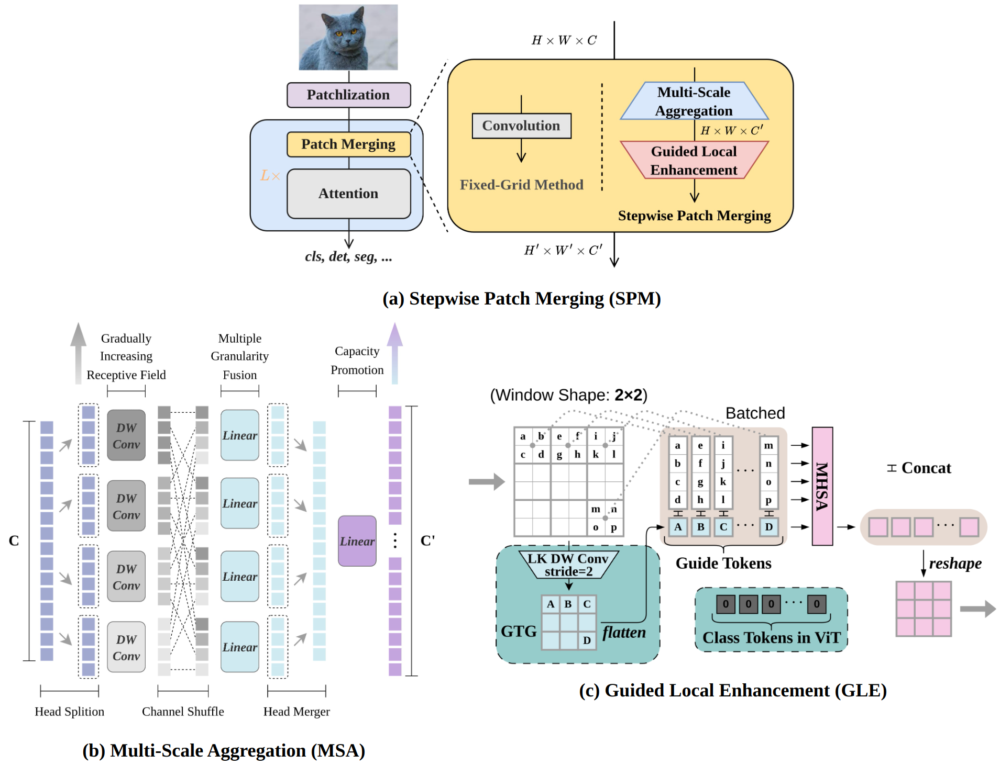

# Stepwise Patch Merging

This repo is the official implementation of ["Brain-Inspired Stepwise Patch Merging for Vision Transformers"](https://arxiv.org/abs/2409.06963).

## Introduction

Hierarchical architectures have become the mainstream design paradigm for Vision Transformers (ViTs), where Patch Merging serves to convert a columnar structure into a hierarchical one.
Specifically, Patch Merging generally uses a single convolution to transform a tensor of shape $(C, H, W)$ into $(C^\prime, H^\prime, W^\prime)$, where $H^\prime=\frac{H}{2}$, $W^\prime=\frac{W}{2}$, and typically $C^\prime=2C$.
**Stepwise Patch Merging (SPM)** splits the above process into two steps:
1. $(C, H, W)\rightarrow (C^\prime, H, W)$, where we adopt a multi-scale approach to make the tokens more informative, accommodating larger tensor capacity while employing lightweight techniques to avoid excessive parameter count and computational overhead. This process is referred to as **Multi-Scale Aggregation (MSA)**.
2. $(C^\prime, H, W)\rightarrow (C^\prime, H^\prime, W^\prime)$, where we use global information to guide the generation of fine-grained details, an approach demonstrated by experiments to be highly effective, called **Guided Local Enhancement (GLE)**.



## Citation

```
@article{yu2024brain,
  title={Brain-Inspired Stepwise Patch Merging for Vision Transformers},
  author={Yu, Yonghao and Zhao, Dongcheng and Shen, Guobin and Dong, Yiting and Zeng, Yi},
  journal={arXiv preprint arXiv:2409.06963},
  year={2024}
}
```

## Acknowledgement

The design and implementation of MSA are inspired by [SMT](https://github.com/AFeng-x/SMT).